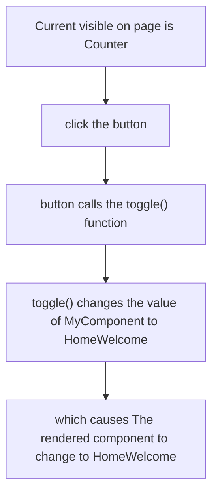

# Dynamic Components

1. use the Vue `<component>` tag 

2. syntax is : `<component :is="someComputedComponent">`

3. resolve the component using `resolveComponent()` helper function provided by Vue 

### example 1

```Vue
<!-- in app.vue -->
<template>
    <component :is="clickable? MyButton: 'div'" />
</template>

<script setup>

const MyButton = resolveComponent('MyButton Component')

</script>
```

### example 2 


#### code : 


```Vue
<!-- in app.vue -->
<template>
    <button @click="toggle"> Toggle </button>
    <component :is="MyComponent" />
</template>

<script setup>
    // ref allows us to update MyComponent
    // ref() is from vue
    // shallowRef() has a better performace
    const MyComponent = shallowRef(resolveComponent("Counter"));

    // create a the toggle() function
    // changes the value of MyComponent to the resolved HomeWelcome component
    // allows us to toggle between components
    function toggle() {
        MyComponent.value = resolveComponent("HomeWelcome");
    }
</script>
```

### example 3 

code 

```Vue
<!-- in app.vue -->
<template>
    <button @click="toggle"> Toggle </button>
    <div v-if="MyComponent === 'welcome'">
        <HomeWelcome />
    </div>
    <Counter v-else />

</template>

<script setup>

    const MyComponent = ref("counter");

    function toggle() {
        MyComponent.value = "welcome";
    }

</script>

```


<hr>

## Dynamic Imports 

1. to dynamically import a component all we need to do is to add the Lazy prefix to the component's name

2. this is also called the lazy loading a component

3. the lazy component is not directly available, but only when requested

4. 

example:

```Vue
<template>
    <div>
        <TheHeader />
        <slot />
        <LazyFooter />
    </div>
</template>

```


